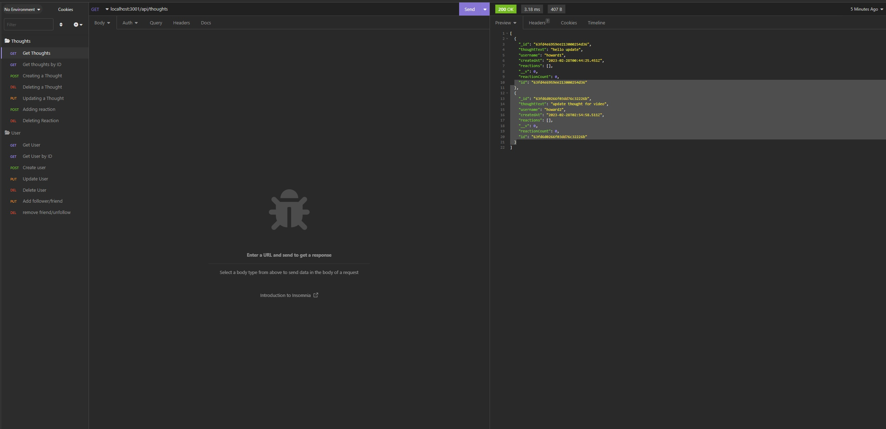

# social-network-challenge

This is a social network app that allows people to follow users and allow users to have thoughts and give other people the option to react to peoples thought.

In this challenge, we learned about mongoDB. We learned how to create CRUD command for a mongodb application.

## Installation
- requires mongooose 
- requires express
- requires node.js
- requires express

## Usage
The use of this application requires insominia. users can perform Get, Put, Post, Delete commands to update the DB

## Features
[Video link](https://drive.google.com/file/d/13I49oZRqJXX74FoO_0OyycENWl_sUhBU/view) 

- create user
- delete user 
- update user
- user can post thoughts
- user can delete thoughts
- user can add reaction to other people thoughts
- user can follow other users
